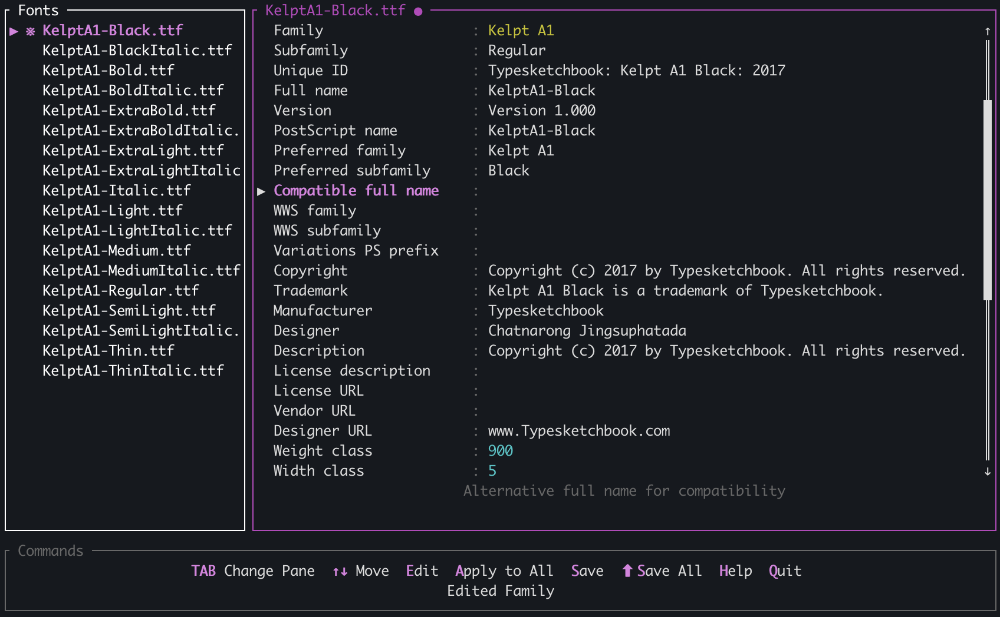

# FontMeta

A terminal UI for viewing and editing font metadata in TTF/OTF files.
My main goal was an app to quickly rename the family 



## Build & Run

Requires [Rust](https://rustup.rs).

```sh
cargo build --release
./target/release/fontmeta [-o <output dir>] [font files...]
```

Or run directly:

```sh
cargo run --release -- [-o <output dir>] [font files...]
```

Font files are optional — you can launch with no arguments and drag files into the terminal window or paste paths after launch. Edited fonts are saved to an `Export/` folder in the current directory by default; use `-o` to change it.
